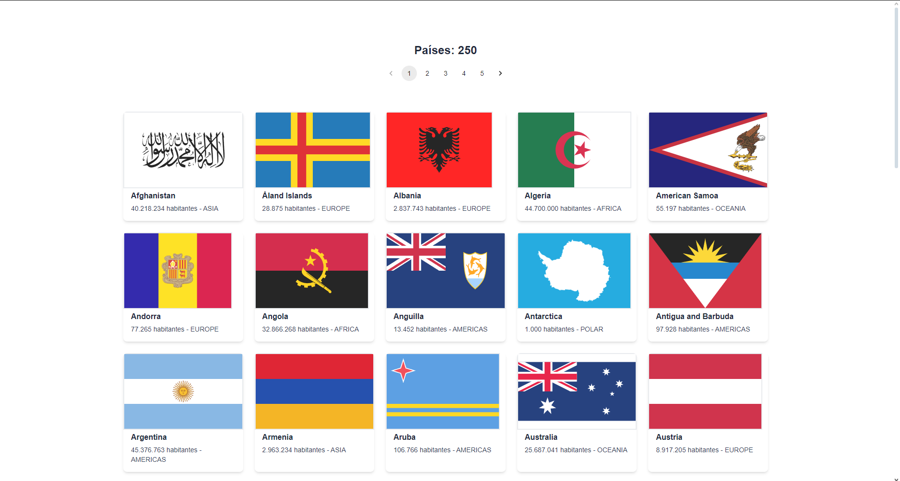

# Countries List

Projeto desenvolvido para desenvolver e aprimorar habilidades no REACT.

Foi utilizada uma API para a listagem dos países com algumas de suas informações, essa listagem foi paginada.


## Fazendo o download e iniciando o projeto

Após realizar o download do projeto abra ele no VS Code ou editor similar e execute os seguintes comandos:

- Instalar os pacotes que foram usados no desenvolvimento:

```git
npm i
```

- Executar o projeto

```node
npm run dev
```

<hr>
Após abrir o localhost gerado para visualização do projeto sua tela deverá ser semelhante a essa:
